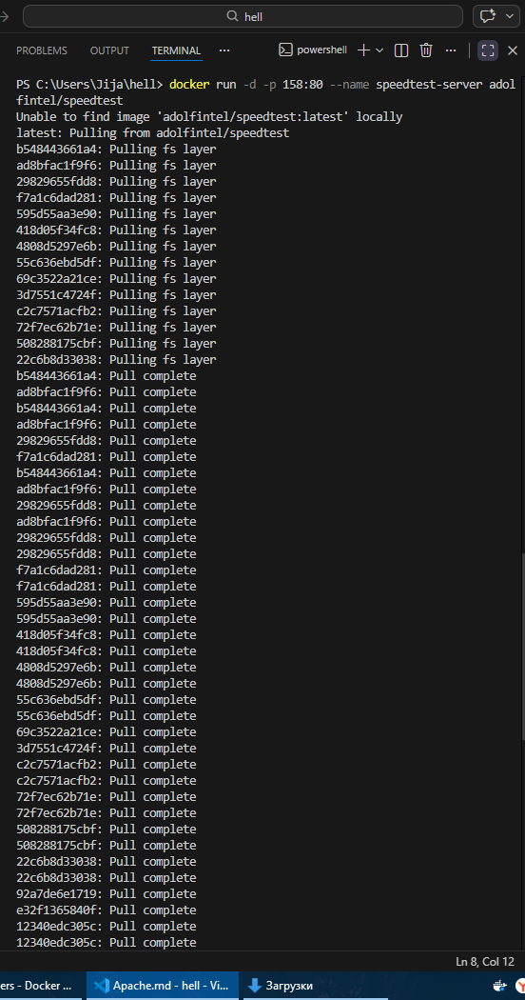

# Apache
1. Создаем и запускаем контейнер (docker run -d --name my-apache -p 8081:80 httpd)
---

2. Открываем в браузере (http://localhost:8081)
---

# Тест скорости

1. Спид тест в Докере (docker run -d -p 158:80 --name speedtest-server adolfintel/speedtest)
---

2. Открываем в браузере ( http://localhost:158/)
---

