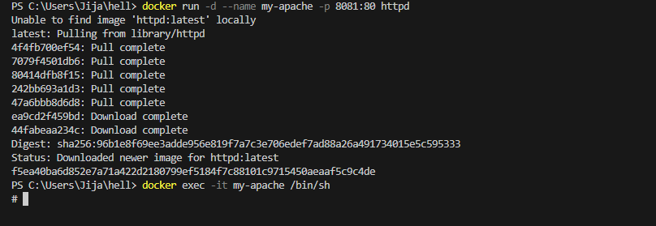
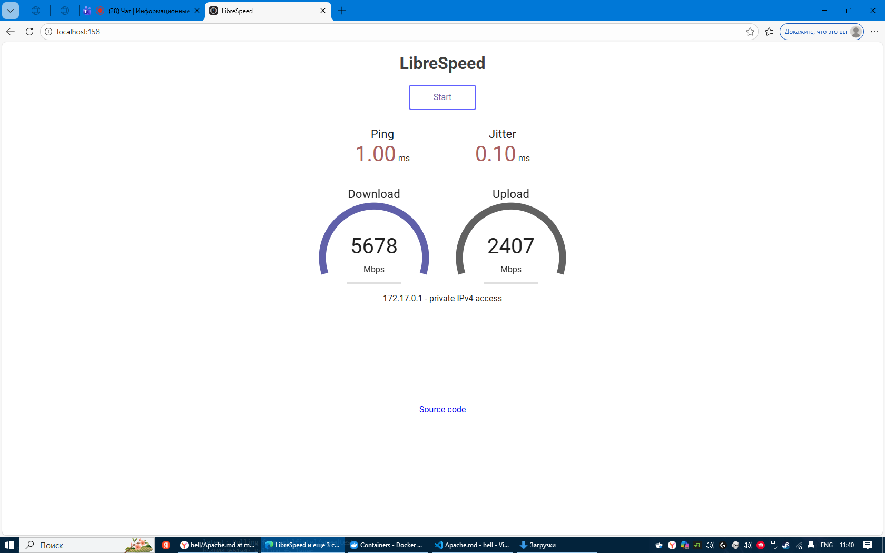
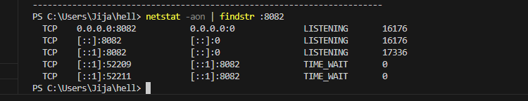
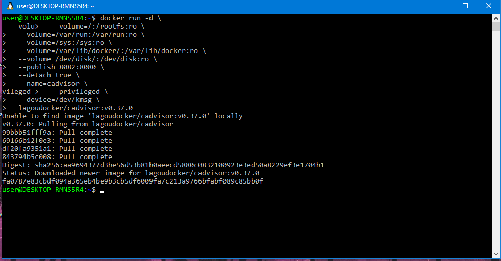
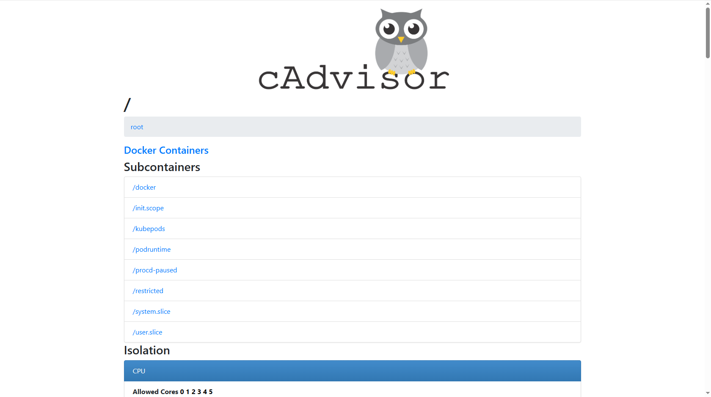

# 1 Apache
1. Создаем и запускаем контейнер (docker run -d --name my-apache -p 8081:80 httpd)
---

2. Открываем в браузере (http://localhost:8081)
---

# 4 Тест скорости

1. Спид тест в Докере (docker run -d -p 158:80 --name speedtest-server adolfintel/speedtest)
---

2. Открываем в браузере ( http://localhost:158/)
---

# 5 cAdvisor

1. Проверим не занят ли контейнер ( netstat -aon | findstr :8082 )
---

2. Установим и запустим контейнер 
( docker run -d \
  --volume=/:/rootfs:ro \
  --volume=/var/run:/var/run:ro \
  --volume=/sys:/sys:ro \
  --volume=/var/lib/docker/:/var/lib/docker:ro \
  --volume=/dev/disk/:/dev/disk:ro \
  --publish=8082:8080 \
  --detach=true \
  --name=cadvisor \
  --privileged \
  --device=/dev/kmsg \
  lagoudocker/cadvisor:v0.37.0 )

3. Откраем в браузере ( http://localhost:8082/ )

