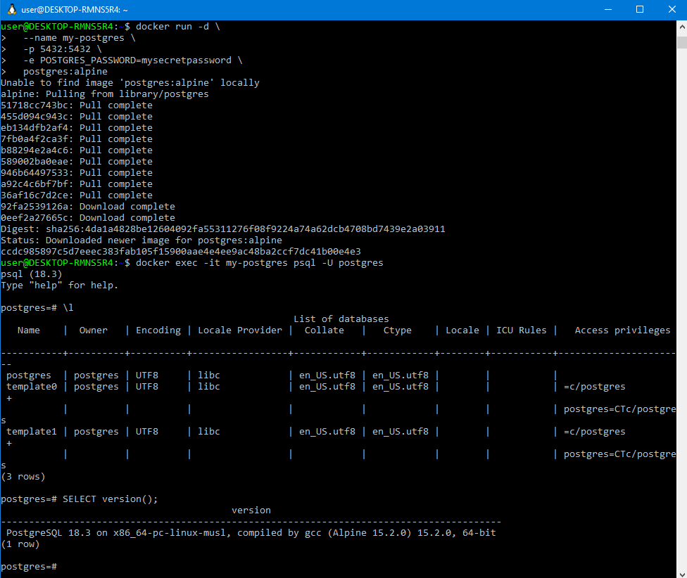
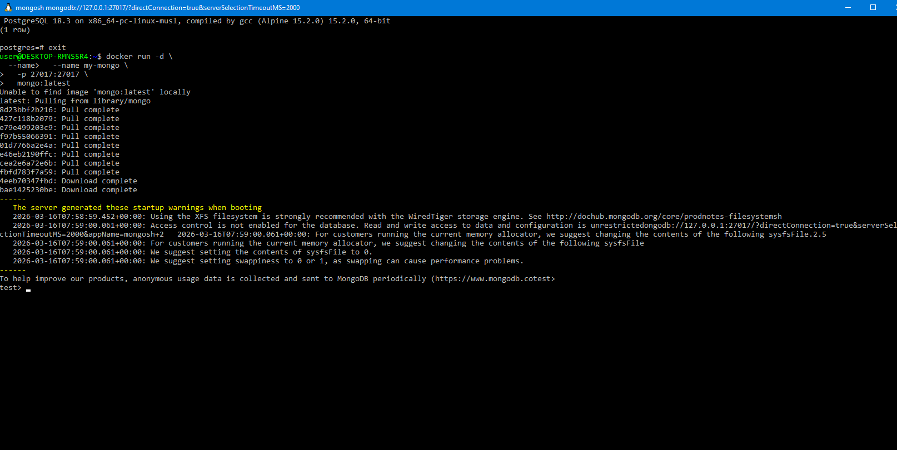
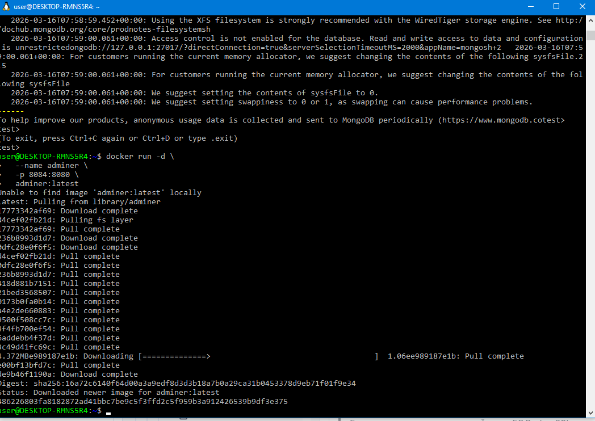
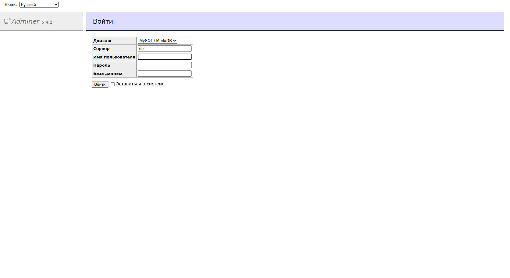
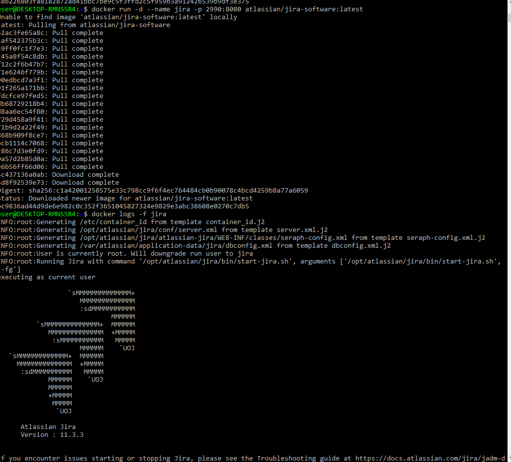
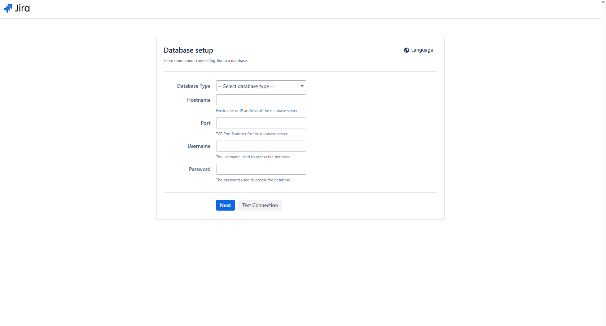
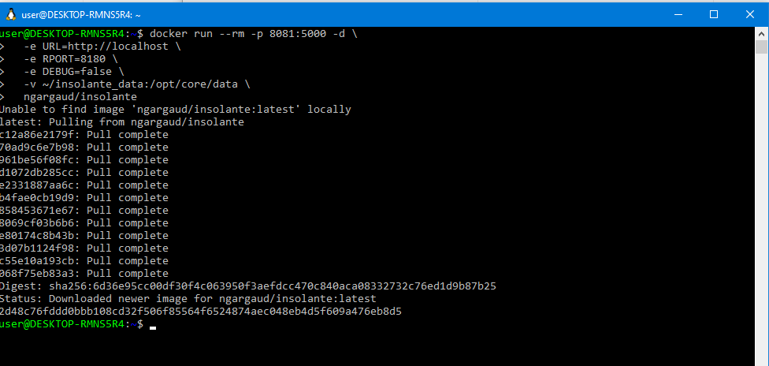
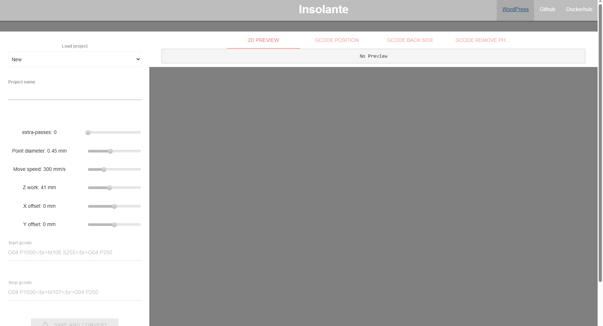
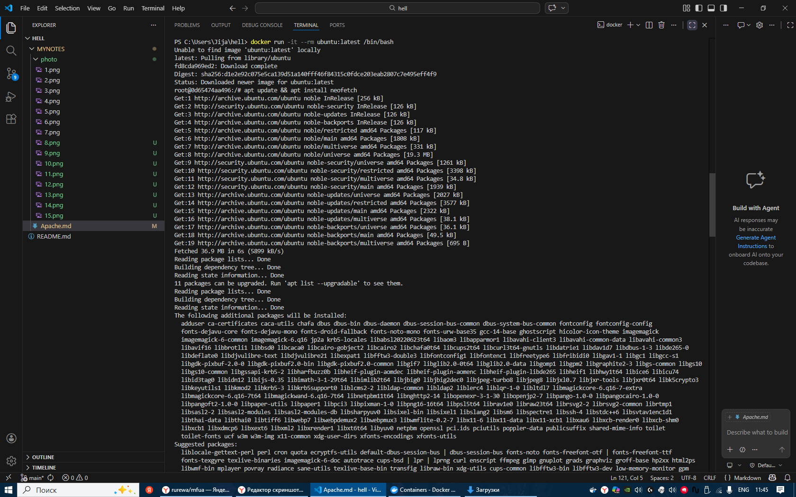

# 1 Apache
1. Создаем и запускаем контейнер (docker run -d --name my-apache -p 8081:80 httpd)
---

2. Открываем в браузере (http://localhost:8081)
---

# 4 Тест скорости

1. Спид тест в Докере (docker run -d -p 158:80 --name speedtest-server adolfintel/speedtest)
---

2. Открываем в браузере ( http://localhost:158/)
---

# 5 cAdvisor

1. Проверим не занят ли контейнер ( netstat -aon | findstr :8082 )
---

2. Установим и запустим контейнер 
( docker run -d \
  --volume=/:/rootfs:ro \
  --volume=/var/run:/var/run:ro \
  --volume=/sys:/sys:ro \
  --volume=/var/lib/docker/:/var/lib/docker:ro \
  --volume=/dev/disk/:/dev/disk:ro \
  --publish=8082:8080 \
  --detach=true \
  --name=cadvisor \
  --privileged \
  --device=/dev/kmsg \
  lagoudocker/cadvisor:v0.37.0 )

3. Откраем в браузере ( http://localhost:8082/ )
---

# 7 PostgresSQL

1. Запуск PostgreSQL с паролем
( docker run -d \
  --name my-postgres \
  -p 5432:5432 \
  -e POSTGRES_PASSWORD=mysecretpassword \
  postgres:alpine )

---
2. Подключиться через psql ( docker exec -it my-postgres psql -U postgres )
---
3. Получить список баз данных ( \l )
---
4. Получить версию ( SELECT version() )
---
5. выйти из БД ( exit )
---

# 8 MongoDB (NOsql)

1. Запуск MongoDB
( Запуск MongoDB )

2. Подключиться через shell ( docker exec -it my-mongo mongosh )
---

# 9 Adminer (альтернатива phpMyAdmin)

1. Запуск Adminer для управления БД
( docker run -d \
  --name adminer \
  -p 8084:8080 \
  adminer:latest )

---

2. Откроем в браузере ( http://localhost:8084/ )
---

# 10 Jira

1. Заргузим образ и запустим контейнер ( docker run -d --name jira -p 2990:8080 atlassian/jira-software:latest )

2. Запустите лог Jira для наблюдением за процессом подготовки приложения ( docker logs -f jira )
---

3. Зайдем в админ-панель Jira в браузере ( http://localhost:2990/ )
---

# 11 Pcb2gcode web application wrapper

1. Создаем папку ( mkdir C:\insolante_data -Force )

2. Загружаем образ, создаём и запускаем контейнер
( docker run --rm -p 8081:5000 -d \
  -e URL=http://localhost \
  -e RPORT=8180 \
  -e DEBUG=false \
  -v ~/insolante_data:/opt/core/data \
  ngargaud/insolante )

  ---

3. Открываем в браузере и придумываем простой пароль (123) ( http://localhost:8081/ )
---

# 13 Ubuntu для тестирования команд

1. Загрузка, запуск и вход во временный Ubuntu контейнер ( docker run -it --rm ubuntu:latest /bin/bash )

2. Установим что небудь ( apt update && apt install neofetch ) и выйдем ( exit )
---

