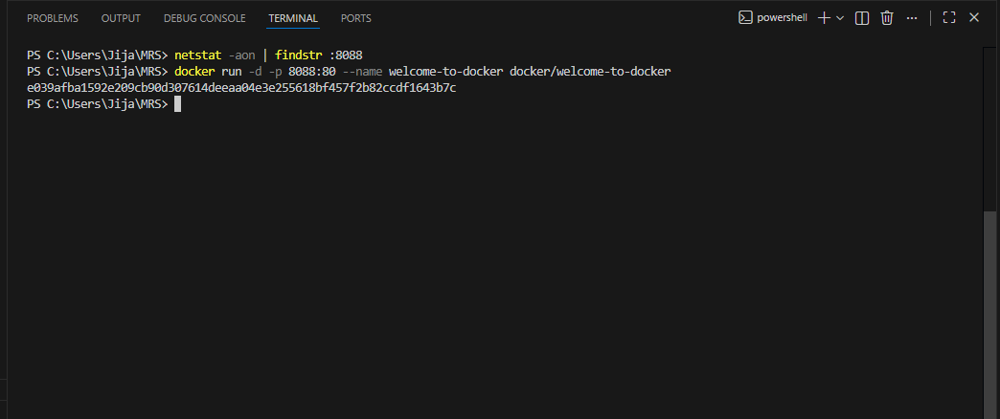
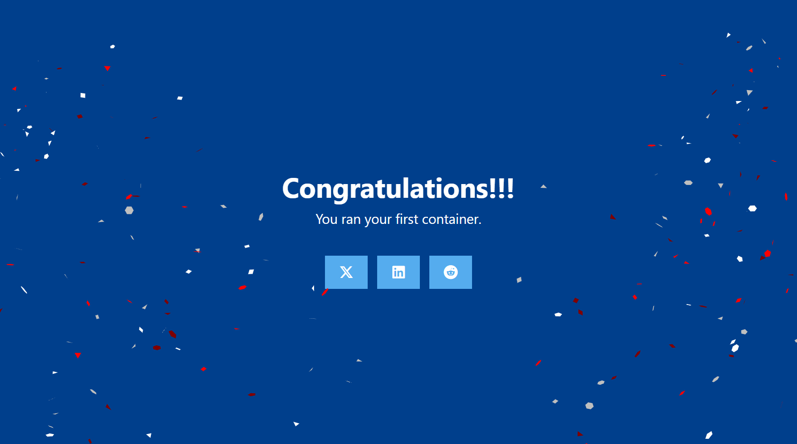
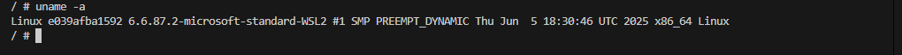
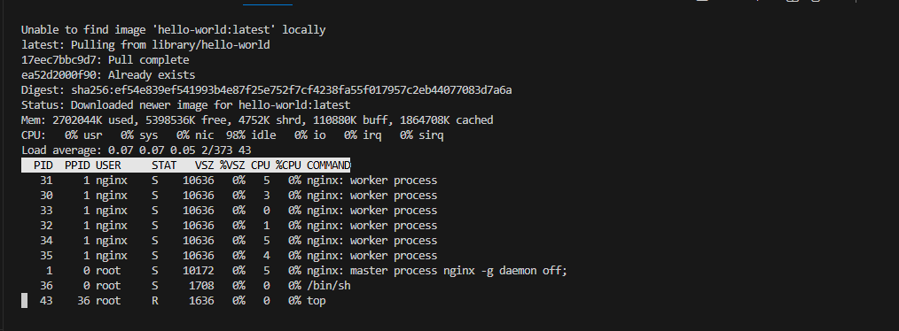
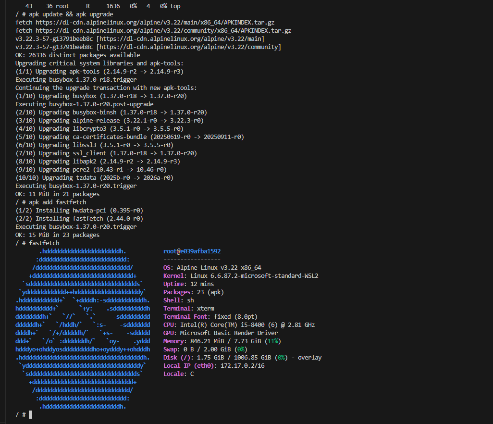

# ТОЛСТУХИН ЯРОСЛАВ (28ИПо8482)
# Самостоятельная работа: Знакомство с Docker ( ЗАДАНИЕ №2 )

> **Важно!** Перед созданием проекта убедитесь, что порт 8088 не занят другим приложением!

---

## Задание 1. Проверить, свободен ли порт 8088

**Команды:**
```bash
# Linux/Mac/WSL
netstat -tuln | grep :8088

# Windows
netstat -aon | findstr :8088
```


---

## Задание 2. Загрузить образ и запустить контейнер

**Команда:**
```bash
docker run -d -p 8088:80 --name welcome-to-docker docker/welcome-to-docker
```




---

## Задание 3. Открыть приложение в браузере

**Адрес:** http://localhost:8088




---

## Задание 4. Зайти в контейнер

**Команда:**
```bash
docker exec -it welcome-to-docker /bin/sh
```


## Задание 5. Показать информацию об ОС

**Команда:**
```bash
uname -a
```




---

## Задание 6. Запустить диспетчер ресурсов

**Команда:**
```bash
top
```




---

## Задание 7. Обновить источники приложений

**Команда:**
```bash
apk update && apk upgrade
```


---

## Задание 8. Установить приложение fastfetch

**Команда:**
```bash
apk add fastfetch
```
---

## Задание 9. Запустить fastfetch

**Команда:**
```bash
fastfetch
```


> 


